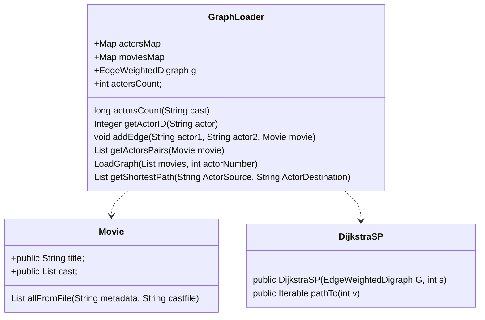

# Práctica 2 - Grafos

Análisis y Diseño de Software, 2022

Grado en Ingeniería de Tecnologías y Servicios de 
Telecomunicación 

ETSI de Telecomunicación

Universidad Politécnica de Madrid

# Introducción
En la práctica 2 se pide realizar un algoritmo que calcule el [número de Bacon](https://es.wikipedia.org/wiki/N%C3%BAmero_de_Bacon), es decir, calcular cuál es el camino mínimo de películas que hay entre dos actores. 

[Esta web calcula el número de Bacon](https://oracleofbacon.org/), que ilustra lo que habrá que hacer en la práctica 2.

Para llegar al objetivo final de la práctica 2, es necesario realizar dos partes:

1. Los métodos propuestos [en el laboratorio 2](https://github.com/adsw-upm/adsw-laboratorios/tree/main/adsw-lab-2) y que son totalmente necesarios para hacer la práctica 2.
      * `Integer getActorID(String actor)`
      * `void addEdge(String actor1, String actor2, Movie movie)`
      * `List<String[]> getActorsPairs(Movie movie)`
      * `void loadGraph(List<Movie> movies, int actorNumber)` 
2. Un método adicional que calcule el camino mínimo entre dos actores con las siguiente signatura: 
      * `List<String> getShortestPath(String ActorSource, String ActorDestination)`
  
# El proyecto inicial **ADSW-practica2-2022.zip**

Se ha proporcionado el proyecto **ADSW-practica2-2022.zip** que contienen la clase `Movie`, una plantilla de la clase `GraphLoader` y el *script* `Practica2Entrega`, para la entrega. No es necesario referenciar a los resultados del laboratorio 1 o de la práctica 1.

Sobre la clase `GraphLoader` con todos los métodos vacíos:

1. Incialmente, todos los métodos están vacíos. 
2. Donde hay que incluir los métodos desarrollados en el [laboratorio 2](https://github.com/adsw-upm/adsw-laboratorios/tree/main/adsw-lab-2)
3. Completar el método nuevo a implementar: `List<String> getShortestPath(String ActorSource, String ActorDestination)`

En la clase `Movie` se quiere obtener el título y *casting*. Para ello, se pueden usar sus métodos *getters*:

```java
public List<String> getCast()
public String getTitle()
```

# Objetivo de la Práctica 2
En el laboratorio 2, se propuso desarrollar un conjuto de métodos  la clase `GraphLoader`. El objetivo era modelar las películas en un grafo de la biblioteca de **Princeton** `EdgeWeightedDigraph`. En esta clase, se dispone de un atributo de clase o campo `g`, que se debe cargar al ejecutar el método `void loadGraph(List<Movie> movies, int actorNumber)`.

En la práctica 2, se pude desarrollar un un método que calcule el camino mínimo entre dos actores, con la siguiente signatura:

`List<String> getShortestPath(String ActorSource, String ActorDestination)`

Si, por ejemplo, se dispone un grafo como el siguiente:


Si se invoca el método con los siguientes parámetros: `getShortestPath("Kevin Bacon", "Carmen Machi")`, se deberá devolver un objeto de la clase `List`, cuyos elementos es de la clase `String`, con el siguiente contenido: 

"Kevin Bacon", "Apollo 13", "Tom Hanks", "Bridge of Spies", "Joachim Paul Assböck", "Off Course", "Carmen Machi"

Es decir, en la list se deben incluir los actores que han colaborado entre películas,  así como las películas en las que han colaborado cada par de los actores, con la secuencia que se ilustra:

Con el resultado anterior, se entiende que: 
* **Kevin Bacon** colaboró en la película **Apollo 13** con **Tom Hanks**
* **Tom Hanks** colaboró en la película **Bridge of Spies** con **Joachim Paul Assböck**
* **Joachim Paul Assböck** colaboró en la película **Off Course** con **Carmen Machi**
     
👀NOTA: si no hay camino entre dos actores, es decir, no se encuentra un conjunto de actores donde hayan colaborado entre películas. EL MÉTODO DEBE DEVOLVER NULL.

# Diagrama de clases 🎥

### Descripción del diagrama de clases.

Atributos de clase `GraphLoader`:

  * `EdgeWeightedDigraph g` es el grafo dirigido donde vamos a representar los vértices (actores) y las aristas (película donde han actuado un par de actores).
  * `int actorsCount = 0` nos servirá para saber cual es el último número de actor que hemos introduccido.
  * `Map<String, Integer> actorsMap` Es un mapa en el que la clave será el nombre del actor y nos devolverá un objeto de la clase Integer. Este valor nos indicará el vértice del actor en el grafo. Nos será muy útil en la práctica.
  * `Map<DirectedEdge, Movie> moviesMap` Es un mapa donde la clave será ina arista y nos devolverá una película de la clase Movie. Este valor nos indicará la película asociada a una arista. Igualmente nos será muy útil en la práctica.

El código para buscar el camino mínimo en grafo según el modelo de **Princeton** desde un origen lo tenemos en la clase `DijkstraSP` dentro del paquete **edu.princeton.cs.algs4**. Este código nos ayudará a encontrar los caminos mínimos desde un origen. Aquí os describimos los más relevantes. Método contructor de clase `DijkstraSP`:

  * `public DijkstraSP(EdgeWeightedDigraph G, int s)` método constructor con la siguiente descripción:
  
```java
      /**
     * Compute a shortest-paths tree from the source vertex {@code s} to every other
     * vertex in the edge-weighted digraph {@code G}.
     *
     * @param  G the edge-weighted digraph
     * @param  s the source vertex
     * @throws IllegalArgumentException if an edge weight is negative
     * @throws IllegalArgumentException unless {@code 0 <= s < V}
     */
```

  * `public Iterable<DirectedEdge> pathTo(int v)` método para conseguir todos los `DirectedEdge` a un destino con la siguiente descripción:
```java    
     /**
     * Returns a shortest path from the source vertex {@code s} to vertex {@code v}.
     *
     * @param  v the destination vertex
     * @return a shortest path from the source vertex {@code s} to vertex {@code v}
     *         as an iterable of edges, and {@code null} if no such path
     * @throws IllegalArgumentException unless {@code 0 <= v < V}
     */
```
     
## Consideraciones a tener en cuenta.
1. Para saber el vértice que corresponde a un actor podemos usar el mapa `Map<String, Integer> actorsMap`.
2. Pero si se quiere hacer la búsqueda inversa, y saber el nombre del actor a partir del número de vértice, se puede invertir el diccionario anterior con el siguiente método: `Map<Integer, String> getActorsMapInverted()` Este método devuelve justo el diccionario invertido. Se podrá buscar por un número de vertice en concreto y obtendremos el nombre del actor.
3. Para saber cúal es la película que se corresponde a un `DirectedEgde`, esa información se dispone en `Map<DirectedEdge, Movie> moviesMap`
4. Aclaraciones sobre el método `List<String[]> getActorsPairs(Movie movie)` (Realizado en el laboratorio 2):
Este método debe devolver en una lista, todos los pares de colaboraciones de dos actores en una película. Pero cada pareja debe estar una vez, y da igual quien sea el primero o el segundo. Según el ejemplo del grafo de arriba: una pareja de actores sería "Clint Howard" y "Diane Lane" o "Diane Lane" y "Clint Howard". Cualquiera de las dos formas de contar la pareja es equivalente, pero el método no devolver las dos.

Siguiendo el ejemplo del grafo de arriba.

Si preguntamos por el `getActorsPairs(Movie movie)`, de la película **My Dog Skyp** debería devolver una lista con los siguientes valores: 

✔️`[String[0]= "Clint Howard", String[1]="Diane Lane"]`

✔️`[String[0]= "Clint Howard", String[1]="Kevin Bacon"]`

✔️`[String[0]= "Diane Lane", String[1]="Kevin Bacon"]`

(El método void `addEdge(String actor1, String actor2, Movie movie)` se encargará de crear dos `DirectedEdge` uno para cada dirección.)

El método estaría mal si devolviera los siguientes pares de parejas:

✔️`[String[0]= "Clint Howard", String[1]="Diane Lane"]`

❌`[String[0]= "Diane Lane", String[1]="Clint Howard"]`

✔️`[String[0]= "Clint Howard", String[1]="Kevin Bacon"]`

❌`[String[0]= "Kevin Bacon", String[1]="Clint Howard"]`

✔️`[String[0]= "Diane Lane", String[1]="Kevin Bacon"]`

❌`[String[0]= "Kevin Bacon", String[1]="Diane Lane"]`

**Porque estaríamos repitiendo parejas**

El método también estaría mal si devuelve una pareja con un actor que sea él mismo, como por ejemplo:

❌`[String[0]= "Kevin Bacon", String[1]="Kevin Bacon"]`

# Anexo 1: Instrucciones para la entrega

*	El código fuente de todo el proyecto deberá entregarse en el Moodle de la asignatura antes de las 23:59 del 22/04/2022.
*	El proyecto ADSW-practica2 incluye un script de entrega (`Practica2Entrega.launch`) que se puede ejecutar seleccionando el *script* y ejecutándolo como:  Run &rarr; Run As &rarr; Practica2Entrega. Este *script* nos va indicando en la consola de *eclipse* los pasos que va dando (chequeos y compilaciones, ejecuciones de pruebas, calculo de notas, comprimir entregas, subidas a moodle, ...). Nos muestra la estimación de nota calculada, y muestra en la esquina superior izquierda de la pantalla una ventana para subir la entrega. Si queremos hacer la entrega, nos pide el usuario y contraseña de moodle, para subir la entrega. Si no queremos hacer la entrega simplemente cancelamos y terminará. 
*	Al realizar la entrega se informará, que estará disponible a revisión por parte del profesor, así como información sobre los fallos detectados.
*	Para la evaluación de la entrega, sólo se considerará el último envío realizado.
*	**No se aceptarán entregas fuera de plazo bajo ningún concepto, ni entregar la práctica con otros medios**.
* **Los dos miembros de un grupo tienen que entregar la práctica**

#Anexo 2: AVISO MUY IMPORTANTE

Se recuerda a los alumnos que el trabajo es individual o grupos de dos, y que la copia de entregas supondrá́ el suspenso en la asignatura de forma automática, tanto para quien copia como para quien se deja copiar. En esta práctica, los métodos desarrollados en el laboratorio 2 deben ser el resultado del trabajo de cada grupo.

No está permitido:

*	Realizar este trabajo en grupos de mas de dos
*	Copiar el trabajo de otro grupo, ni permitir la copia del propio trabajo, ni siquiera parcialmente.
*	Usar código publicado sin citar el origen.
