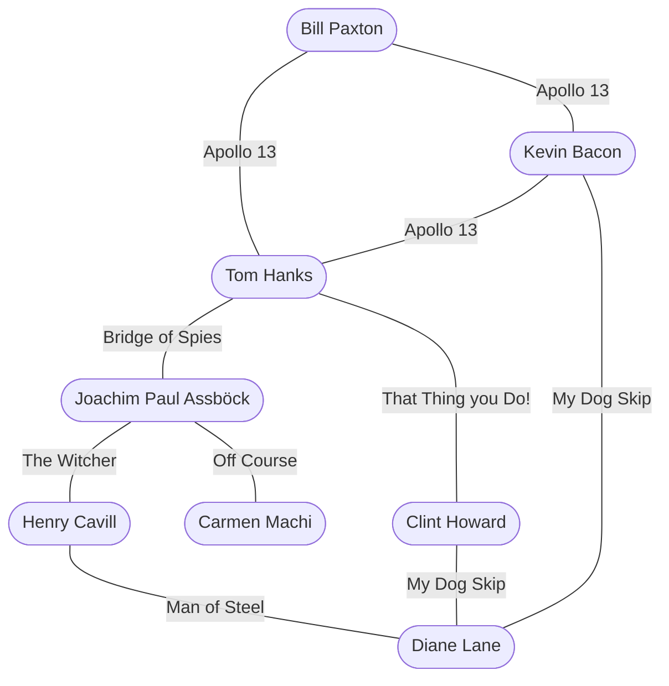
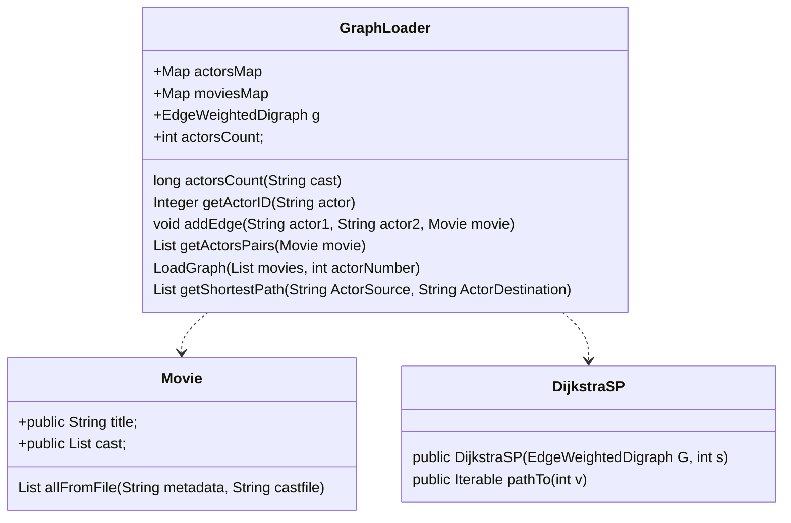

# Práctica 2 - Grafos

Análisis y Diseño de Software, 2022

Grado en Ingeniería de Tecnologías y Servicios de 
Telecomunicación 

ETSI de Telecomunicación

Universidad Politécnica de Madrid

# Introducción
En la práctica 2 queremos realizar un algoritmo que haga el cálculo del [número de Bacon](https://es.wikipedia.org/wiki/N%C3%BAmero_de_Bacon), es decir, calcular cuál es el camino mínimo de películas que hay entre dos actores. 

[Esta web calcula el número de Bacon](https://oracleofbacon.org/), que ilustra lo que habrá que hacer en la práctica 2.

Para llegar al objetivo final de la práctica 2, vamos a tener que realizar dos partes:

1. Los métodos que proponemos [en el laboratorio 2](https://github.com/adsw-upm/adsw-laboratorios/tree/main/adsw-lab-2) y que son totalmente necesarios para hacer la práctica 2.
      * `Integer getActorID(String actor)`
      * `void addEdge(String actor1, String actor2, Movie movie)`
      * `List<String[]> getActorsPairs(Movie movie)`
      * `void loadGraph(List<Movie> movies, int actorNumber)` 
2. Un método adicional que calcule el camino mínimo entre dos actores con las siguiente signatura: 
      * `List<String> getShortestPath(String ActorSource, String ActorDestination)`
  
# Requisitos para importar el proyecto inicial **ADSW-practica2-2022.zip**
Os hemos facilitado el proyecto **ADSW-practica2-2022.zip** para empezar con la práctica 2, este código hace referencia al proyecto **lab1-ordenacion**, no es necesario tener resuelta la práctica 1 correctamente. 

Solo queremos usar la clase `Movie`. Es posible que tengamos que cambiar la visibilidad de los atributos *title* y *cast* de la clase `Movie` y ponerlos a *public* para que sean accesibles desde nuestro proyecto. Como mostramos en el siguiente cuadro:

```java
/**
* Título de la película en inglés
*/
public String title;
/**
* Elenco de la película. Ejemplo: "Tom Hanks", "Matt Damon"...
*/
public List<String> cast;
```

# Requisitos para empezar la Práctica 2

La práctica 2 se entiende como una continuación del Laboratorio 2. Por lo tanto, deberá haber finalizado los métodos de laboratorio 2.
[Aquí tiene el enunciado del laboratorio 2](https://github.com/adsw-upm/adsw-laboratorios/tree/main/adsw-lab-2)
Debes copiar los siguientes métodos a la clase `GraphLoader` de la práctica 2:
 1. `Integer getActorID(String actor)`
 2. `void addEdge(String actor1, String actor2, Movie movie)`
 3. `List<String[]> getActorsPairs(Movie movie)`
 4. `void loadGraph(List<Movie> movies, int actorNumber)`
     
# Objetivo de la Práctica 2
En el laboratorio 2 a través de los métodos anteriores cargamos en un objeto la clase `GraphLoader` toda la información referente a las Películas.

De tal manera que en un objeto de dicha clase tiene un atributo de clase o campo `g` que representa el grafo que hemos cargado al ejecutar el método `void loadGraph(List<Movie> movies, int actorNumber)`

En la práctica 2 queremos un método que calcule en camino mínimo entre dos actores con la siguiente signatura:

`List<String> getShortestPath(String ActorSource, String ActorDestination)`

Si, por ejemplo, tenemos un grafo como el siguiente:



Tras ejecutar el método de la siguiente manera: `getShortestPath("Kevin Bacon", "Carmen Machi")`
El método devolverla los siguientes String en un objeto List: "Kevin Bacon", "Apollo 13", "Tom Hanks", "Bridge of Spies", "Joachim Paul Assböck", "Off Course", "Carmen Machi"

Es decir, no solo devolverá los actores que han colaborado entre películas, si no que también devolverá las películas en las que han colaborado cada par de actores.

Con el resultado anterior, se entiende que: 
* **Kevin Bacon** colaboró en la película **Apollo 13** con **Tom Hanks**
* **Tom Hanks** colaboró en la película **Bridge of Spies** con **Joachim Paul Assböck**
* **Joachim Paul Assböck** colaboró en la película **Off Course** con **Carmen Machi**
     
👀NOTA: si no hay camino entre dos actores, es decir, no se encuentra un conjunto de actores donde hayan colaborado entre películas. EL MÉTODO DEBE DEVOLVER NULL.

# Proyecto para empezar
Os proporcionamos un proyecto para empezar con la clase `GraphLoader`:

1. Donde tendremos que copiar los métodos descritos anteriormente del laboratorio 2
2. El nuevo método a implementar: `List<String> getShortestPath(String ActorSource, String ActorDestination)`


# Diagrama de clases

# Descripción del diagrama de clases.

Atributos de clase `GraphLoader`:

  * `EdgeWeightedDigraph g` es el grafo dirigido donde vamos a representar los vértices (actores) y las aristas (película donde han actuado un par de actores).
  * `int actorsCount = 0` nos servirá para saber cual es el último número de actor que hemos introduccido.
  * `Map<String, Integer> actorsMap` Es un mapa en el que la clave será el nombre del actor y nos devolverá un objeto de la clase Integer. Este valor nos indicará el vértice del actor en el grafo. Nos será muy útil en la práctica.
  * `Map<DirectedEdge, Movie> moviesMap` Es un mapa donde la clave será ina arista y nos devolverá una película de la clase Movie. Este valor nos indicará la película asociada a una arista. Igualmente nos será muy útil en la práctica.

El código para buscar el camino mínimo en grafo según el modelo de **Princeton** desde un origen lo tenemos en la clase `DijkstraSP` dentro del paquete **edu.princeton.cs.algs4**. Este código nos ayudará a encontrar los caminos mínimos desde un origen. Aquí os describimos los más relevantes. Método contructor de clase `DijkstraSP`:
  * `public DijkstraSP(EdgeWeightedDigraph G, int s)` método constructor con la siguiente descripción:
  
```java
      /**
     * Computes a shortest-paths tree from the source vertex {@code s} to every other
     * vertex in the edge-weighted digraph {@code G}.
     *
     * @param  G the edge-weighted digraph
     * @param  s the source vertex
     * @throws IllegalArgumentException if an edge weight is negative
     * @throws IllegalArgumentException unless {@code 0 <= s < V}
     */
```

  * `public Iterable<DirectedEdge> pathTo(int v)` método para conseguir todos los `DirectedEdge` a un destino con la siguiente descripción:
```java    
     /**
     * Returns a shortest path from the source vertex {@code s} to vertex {@code v}.
     *
     * @param  v the destination vertex
     * @return a shortest path from the source vertex {@code s} to vertex {@code v}
     *         as an iterable of edges, and {@code null} if no such path
     * @throws IllegalArgumentException unless {@code 0 <= v < V}
     */
```
     
# Consideraciones a tener en cuenta.
1. Para saber el vértice que corresponde a un actor podemos usar el mapa `Map<String, Integer> actorsMap`.
2. Pero si queremos hacer la búsqueda inversa, y saber el nombre del actor a partir del número de vértice, podemos invertir el diccionario anterior con el siguiente método: `Map<Integer, String> getActorsMapInverted()` Este método nos devuelve justo el diccionario invertido. Podremos buscar por un número de vertice en concreto y obtendremos el nombre del actor.
3. Para saber cúal es la película que se corresponde a un `DirectedEgde`, esa información la tenemos en `Map<DirectedEdge, Movie> moviesMap`

# Aclaraciones sobre el método `List<String[]> getActorsPairs(Movie movie)`
(Realizado en el laboratorio 2)
Este método debe devolver en una lista, todos los pares de colaboraciones de dos actores en una película. Es decir, en el ejemplo del grafo de arriba.

Si preguntamos por el `getActorsPairs(Movie movie)`, de la película **My Dog Skyp** debería devolver una lista con los siguientes valores: 

✔️`[String[0]= "Clint Howard", String[1]="Diane Lane"]`

✔️`[String[0]= "Clint Howard", String[1]="Kevin Bacon"]`

✔️`[String[0]= "Diane Lane", String[1]="Kevin Bacon"]`

(El método void `addEdge(String actor1, String actor2, Movie movie)` se encargará de crear dos `DirectedEdge` uno para cada dirección.)

El método estaría mal si devolviera los siguientes pares de parejas:

✔️`[String[0]= "Clint Howard", String[1]="Diane Lane"]`

❌`[String[0]= "Diane Lane", String[1]="Clint Howard"]`

✔️`[String[0]= "Clint Howard", String[1]="Kevin Bacon"]`

❌`[String[0]= "Kevin Bacon", String[1]="Clint Howard"]`

✔️`[String[0]= "Diane Lane", String[1]="Kevin Bacon"]`

❌`[String[0]= "Kevin Bacon", String[1]="Diane Lane"]`

**Porque estaríamos repitiendo parejas**

El método también estaría mal si devuelve una pareja con un actor que sea él mismo, como por ejemplo:

❌`[String[0]= "Kevin Bacon", String[1]="Kevin Bacon"]`
